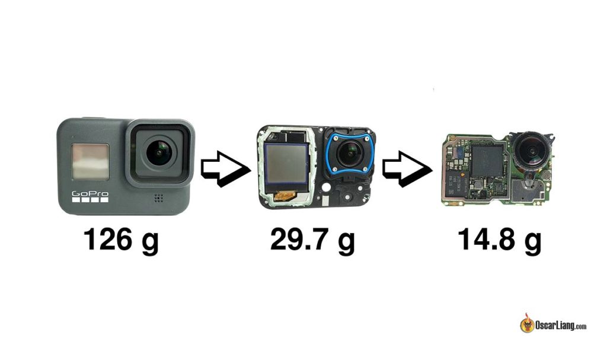

# Drone Project

## references

参考になりそうな資料

- マルチコプタ公開資料

  http://indoor-flight.com/contents/29/download

- ジャイロ＋加速度センサー 基板製作キット C 言語倒立制御プログラム 解説マニュアル

  https://www2.himdx.net/mcr/product/download/2gyro_3acc_module_c_language_headstand_control_program_explanation_manual.pdf

- Open source IMU and AHRS algorithms

  https://x-io.co.uk/open-source-imu-and-ahrs-algorithms/

- 【完全自作】ARDUINOを使用した自作ドローンの製作記（飛んだ！）

  http://akiracing.com/2017/12/17/arduino_drone/

- Arduinoでドローンの自作

  https://garchiving.com/diary-of-drone/

- クアッドコプター（Quadcopter）製作

  https://plaza.rakuten.co.jp/cpu4edu/31002/

- 新入社員が制作実習でドローンの自作に挑戦した話

  https://lab.fujiele.co.jp/articles/3738/

- 【Arduinoドローン自作】NO.5 ソフトウェア製作編

  https://shizenkarasuzon.hatenablog.com/entry/2018/11/23/181215

## 目標

必要最低限の構成でドローンを製作して、まずは飛ばす。

## 構成

ここでドローンのシミュレーションができる。これでシミュレーションをしながら部品を選定していくことにする。

https://www.ecalc.ch/xcoptercalc.php

### フライトコントローラ

姿勢制御を行う。

ドローンを空中に制止させるには姿勢を制御する仕組みが必要。センサーで計測したデータから現在の機体の姿勢を予想し、姿勢を水平に近付けるようにプロペラへ信号を送る。PID制御という方法が使えるらしい（制御工学という分野の話っぽい）。

姿勢制御 - モータの出力を調整して機体を水平に保つ。

　機体の姿勢の計測 - 9軸センサーを使う

　モータ制御 - PWM

​	

Arduinoを使おう。

資料が多いし、最近大学でやってるCがベースだし、ちょうどいいかなと。

http://www.musashinodenpa.com/arduino/ref/

https://pspunch.com/pd/article/arduino_is_c.html

## Arduino + 電子工作に最低限必要なもの

電子部品は秋葉で集めればいいんだけど、北見に戻ったらネットで買うしかないから抵抗とかコンデンサとかよく使う部品はセットで売ってたら一式買っといた方がいいかも。

#### Arduino UNO

全部オープンソースで、回路図も公開されてる。https://www.arduino.cc/

本家は3000円くらいするけど、安い互換製品が沢山あるので今回はそれを使おう。

↓ 安くていい感じだった。USBケーブルもついてる。

[ELEGOO UNO](https://www.amazon.co.jp/ELEGOO-ATmega328P-ATMEGA16U2-USB%E3%82%B1%E3%83%BC%E3%83%96%E3%83%AB-Arduino%E7%94%A8/dp/B06Y5TBNQX/ref=pd_cart_rp_m_604_2_3/358-7085661-0754258?_encoding=UTF8&pd_rd_i=B06Y5TBNQX&pd_rd_r=6152cdd7-9b73-451a-a28f-33931a61bf2b&pd_rd_w=vkiDe&pd_rd_wg=VdIlZ&pf_rd_p=50de250b-22e1-430e-a75a-8ecce3fcf3ff&pf_rd_r=RC1NE3CP37H72D8M4DNJ&psc=1&refRID=RC1NE3CP37H72D8M4DNJ)

#### Arduino NANO

小さい簡易版のやつ。

[KKHMF Mini USB Nano](https://www.amazon.co.jp/KKHMF-ATmega328P-CH340G-%E3%83%9E%E3%82%A4%E3%82%AF%E3%83%AD%E3%82%B3%E3%83%B3%E3%83%88%E3%83%AD%E3%83%BC%E3%83%A9%E3%83%BC%E3%83%9C%E3%83%BC%E3%83%89-%E3%83%A2%E3%82%B8%E3%83%A5%E3%83%BC%E3%83%ABArduino%E3%81%A8%E4%BA%92%E6%8F%9B/dp/B073CHKMB2/ref=pd_cart_rp_m_604_2_2/358-7085661-0754258?_encoding=UTF8&pd_rd_i=B073CHKMB2&pd_rd_r=6152cdd7-9b73-451a-a28f-33931a61bf2b&pd_rd_w=vkiDe&pd_rd_wg=VdIlZ&pf_rd_p=50de250b-22e1-430e-a75a-8ecce3fcf3ff&pf_rd_r=RC1NE3CP37H72D8M4DNJ&psc=1&refRID=RC1NE3CP37H72D8M4DNJ)

#### ブレッドボード

あんまり小さすぎないやつの方がいいと思う。何個かあった方がいいかも。

#### ジャンパ線

[柔らかいタイプ](https://www.amazon.co.jp/dp/B06Y48V9DL/ref=sspa_dk_detail_2?psc=1&pd_rd_i=B06Y48V9DL&pd_rd_w=xnn98&pf_rd_p=6413bd85-d494-49e7-9f81-0e63e79171a9&pd_rd_wg=Twehz&pf_rd_r=E9BA49MT4WSZ25GTP2SK&pd_rd_r=e43aaeb2-a8dc-47ef-8b5d-6fa1bbed33a1&spLa=ZW5jcnlwdGVkUXVhbGlmaWVyPUEzSjVVMlBCM0I2RkxQJmVuY3J5cHRlZElkPUEwMzUzMTM1MlNXVEExRllFRFZRNCZlbmNyeXB0ZWRBZElkPUEzRTQ0RkRNNEIwVzRVJndpZGdldE5hbWU9c3BfZGV0YWlsJmFjdGlvbj1jbGlja1JlZGlyZWN0JmRvTm90TG9nQ2xpY2s9dHJ1ZQ==)と[硬いタイプ](https://www.amazon.co.jp/INCREWAY-560%E5%80%8B-%E4%BA%88%E5%82%99%E6%88%90%E5%BD%A2%E3%83%96%E3%83%AC%E3%83%83%E3%83%89%E3%83%9C%E3%83%BC%E3%83%89%E3%82%B8%E3%83%A3%E3%83%B3%E3%83%91%E3%83%AF%E3%82%A4%E3%83%A4%E3%82%AD%E3%83%83%E3%83%88-14%E9%95%B7%E3%82%B8%E3%83%A3%E3%83%B3%E3%83%91%E3%83%BC%E7%B7%9A%E3%81%AE%E7%9B%9B%E3%82%8A%E5%90%88%E3%82%8F%E3%81%9B-%E3%83%95%E3%83%AA%E3%83%BC%E3%83%9C%E3%83%83%E3%82%AF%E3%82%B9%E4%BB%98%E3%81%8D/dp/B07T48DGD6/ref=sr_1_29?__mk_ja_JP=%E3%82%AB%E3%82%BF%E3%82%AB%E3%83%8A&dchild=1&keywords=%E3%82%B8%E3%83%A3%E3%83%B3%E3%83%91%E7%B7%9A&qid=1593012352&s=industrial&sr=1-29)があった方が便利。

#### はんだごて

白光か太陽電機産業のものだと間違いないと思う。スイッチで急加熱できるタイプが便利。

[白光 No.984-01](https://www.amazon.co.jp/%E7%99%BD%E5%85%89-%E5%8D%8A%E7%94%B0%E3%82%B4%E3%83%86-%E3%83%97%E3%83%AC%E3%82%B9%E3%83%88-%E3%82%AD%E3%83%A3%E3%83%83%E3%83%97%E4%BB%98-No-984-01/dp/B000AQSCQS/ref=sr_1_6?__mk_ja_JP=%E3%82%AB%E3%82%BF%E3%82%AB%E3%83%8A&crid=2KK89T7SHCUNQ&dchild=1&keywords=%E3%83%8F%E3%83%83%E3%82%B3%E3%83%BC+%E5%8D%8A%E7%94%B0%E3%81%94%E3%81%A6&qid=1593012139&sprefix=%E3%83%8F%E3%83%83%E3%82%B3%E3%83%BC%E3%80%80%2Caps%2C254&sr=8-6)

こて先もいろいろある。

https://godhanda.co.jp/blog/kisokouza10/

#### はんだ

お金がなければ百均。

https://godhanda.co.jp/blog/kisokouza03/

#### スズメッキ線

[スズメッキ線](https://www.amazon.co.jp/gp/product/B00FIXM89U/ref=ppx_yo_dt_b_asin_title_o02_s01?ie=UTF8&psc=1)

#### こて台

お金がなければ小手先を綺麗にするのはティッシュを水で浸したやつでいける...

買うならこういう水のいらないタイプが便利と思う。

[白光 こて台 633-01](https://www.amazon.co.jp/%E7%99%BD%E5%85%89-HAKKO-633-01-%E3%81%93%E3%81%A6%E5%8F%B0/dp/B000TGNWCS/ref=asc_df_B000TGNWCS/?tag=jpgo-22&linkCode=df0&hvadid=218131442862&hvpos=&hvnetw=g&hvrand=17608955994375615398&hvpone=&hvptwo=&hvqmt=&hvdev=c&hvdvcmdl=&hvlocint=&hvlocphy=1009562&hvtargid=pla-439503384707&psc=1&th=1&psc=1)

#### 抵抗

必要分だけその都度買ってもいいけど、値を間違えたとか買い忘れがあったというのが面倒なのでまとめ買いしてる方がいいかな。

https://www.amazon.co.jp/gp/product/B078HKZSKG/ref=ppx_yo_dt_b_asin_title_o02_s01?ie=UTF8&psc=1

#### コンデンサ

抵抗に同じ。セラミックコンデンサ（小容量・極性なし）と電解コンデンサ（大容量・極性あり）が主。

https://www.amazon.co.jp/gp/product/B017IGO51S/ref=ppx_yo_dt_b_asin_title_o02_s01?ie=UTF8&psc=1

#### スイッチ

何個かある方がいい。

http://akizukidenshi.com/catalog/g/gP-03647/

#### LED

好きなやつを買えばいい。光らせるのに保護抵抗が必要になる点に注意。

#### LCD

簡単な液晶。

[LCD](https://www.amazon.co.jp/KKHMF-1602-%E3%83%87%E3%82%A3%E3%82%B9%E3%83%97%E3%83%AC%E3%82%A4%E3%83%A2%E3%82%B8%E3%83%A5%E3%83%BC%E3%83%AB-16%C3%972%E3%82%AD%E3%83%A3%E3%83%A9%E3%82%AF%E3%82%BF-LCD%E3%83%96%E3%83%AB%E3%83%BC%E3%83%96%E3%83%A9%E3%83%83%E3%82%AF%E3%83%A9%E3%82%A4%E3%83%88/dp/B0757C4W92/ref=pd_bxgy_img_2/358-7085661-0754258?_encoding=UTF8&pd_rd_i=B0757C4W92&pd_rd_r=b44e5ed6-a571-40f2-8245-58e5ed4fb173&pd_rd_w=PeOcp&pd_rd_wg=wYgSK&pf_rd_p=f9b7301a-70fe-4140-bc13-8df64a58b673&pf_rd_r=ZZTK3ZJ5XYJF8WG8G510&psc=1&refRID=ZZTK3ZJ5XYJF8WG8G510)

LCDを直接Arduinoに繋ぐとなると10本くらい線が必要だけど、アダプタを使ってI2Cという方式で通信すると2本で済む。

[アダプタ](https://www.amazon.co.jp/gp/product/B010Q000V2/ref=ppx_yo_dt_b_asin_title_o01_s00?ie=UTF8&psc=1 )

#### ACアダプタ

ArduinoはPCから電源を取れるのでなくてもいい。でも、モータなんかを回そうと思うとあった方がいいと思う。

#### サーボ

ドローンに使えるかはしらない。けど、PWMの勉強には使えると思う。

http://akizukidenshi.com/catalog/goods/search.aspx?search=x&keyword=%83T%81%5B%83%7B&image=%8C%9F%8D%F5

#### モータ

これだと2セット買わないといけないかな。

[https://www.amazon.co.jp/uxcell-DC%E3%82%B3%E3%82%A2%E3%83%AC%E3%82%B9%E3%83%A2%E3%83%BC%E3%82%BF%E3%83%BC-2%E3%83%96%E3%83%AC%E3%83%BC%E3%83%89%E3%83%97%E3%83%AD%E3%83%9A%E3%83%A9-RC%E3%82%AF%E3%83%AF%E3%83%83%E3%83%89%E3%83%AD%E3%83%BC%E3%82%BF%E3%83%BC-DC-3-7V-40000RPM-2%E5%80%8B%E5%85%A5%E3%82%8A/dp/B00R1LYVM4/ref=sr_1_20?__mk_ja_JP=%E3%82%AB%E3%82%BF%E3%82%AB%E3%83%8A&dchild=1&keywords=%E3%83%97%E3%83%AD%E3%83%9A%E3%83%A9+%E3%83%A2%E3%83%BC%E3%82%BF%E3%83%BC&qid=1593017242&s=toys&sr=1-20](https://www.amazon.co.jp/uxcell-DCコアレスモーター-2ブレードプロペラ-RCクワッドローター-DC-3-7V-40000RPM-2個入り/dp/B00R1LYVM4/ref=sr_1_20?__mk_ja_JP=カタカナ&dchild=1&keywords=プロペラ+モーター&qid=1593017242&s=toys&sr=1-20)

#### 駆動回路

#### センサーなど

秋月電子通商で揃えた。

https://aki.prioris.jp/list/dbe0d1ae-bed9-472e-a191-c0c7904250fb/

それにしても、このakicartというサイトがめっちゃ便利。ここで部品のリストを作っておけばいつでも秋月の買い物かごに一気に入れられる。

[使い方](http://eleclog.quitsq.com/2016/06/akicart.html)

中身については下に挙げる通り。

#### GPS

GPS受信機キット

#### 9軸センサー

BMX055

加速度3 + ジャイロ3 + 地磁気3 で9軸。

#### 温湿度・気圧センサ

BME280

気圧で機体の高度が予想できる。

#### Wifiモジュール

ドローンで使えるかはわからん。

#### SDカードスロット

飛行のログを記録するのに使える。

将来的なこと

## 空撮

高画質を狙うならGoPro？

------

twitterより [tetsu@metatetsu](https://twitter.com/metatetsu)

ドローン愛好家には常識らしい「剥きプロ」というのを知った。 (GoProを分解するとメチャクチャ軽くて高画質な神カメラになる) 装甲とバッテリーを外せばこんなに小さいのか…

------

